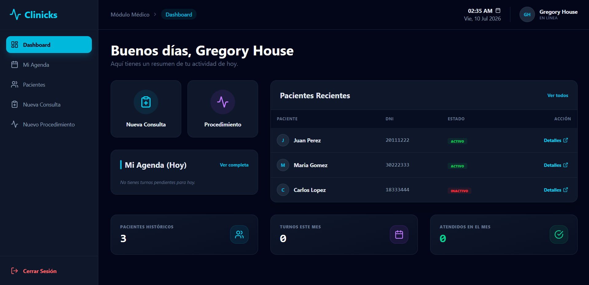
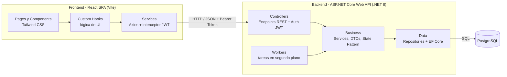

<div align="center">
  <h1 align="center">Clinicks</h1>
  <p align="center">
    <strong>Sistema Integrado de Gestión Hospitalaria y Expediente Clínico Electrónico (EHR)</strong>
    <br />
    <br />
    <a href="#sobre-el-proyecto"><strong>Explorar la documentación »</strong></a>
    <br />
  </p>
</div>

<div align="center">
  
  [](https://github.com/TFacund0/Clinicks-Web/actions/workflows/ci.yml)

  [](https://dotnet.microsoft.com/)
  [](https://reactjs.org/)
  [](https://www.postgresql.org/)
  [](https://tailwindcss.com/)
  [](#licencia)

</div>

<br />

## Sobre el Proyecto

**Clinicks** es una solución tecnológica diseñada para digitalizar, organizar y optimizar las operaciones clínicas y administrativas diarias en centros de salud modernos. A través de una plataforma centralizada y altamente intuitiva, los profesionales médicos pueden gestionar su agenda de turnos, registrar atenciones, documentar procedimientos y acceder al historial clínico electrónico completo de sus pacientes en tiempo real.

El proyecto ha sido desarrollado bajo un fuerte compromiso con las mejores prácticas de la Ingeniería de Software (Arquitectura N-Tier, Patrones de Diseño, Principios SOLID, SoC y DRY), garantizando así un sistema resiliente, mantenible y preparado para alta escalabilidad.

> **Alcance actual**: la versión actual implementa el flujo completo del rol **Médico** (agenda, atenciones, procedimientos e historial clínico). Los roles administrativos están planificados en el roadmap.

---

## Capturas de Pantalla

<!-- TODO: agregar capturas reales en docs/img/ y referenciarlas acá. Sugeridas: dashboard, agenda, historial clínico. -->
<!-- Ejemplo:  -->

*Próximamente: capturas del dashboard, la agenda médica y el historial clínico.*

---

## Características Principales

* **Agenda Médica Inteligente**: Calendario interactivo con vistas diarias, semanales y mensuales. Las consultas se filtran por rango de fechas en el servidor para minimizar la transferencia de datos.
* **Expediente Clínico Electrónico (EHR)**: Línea de tiempo unificada con el historial completo de consultas y procedimientos del paciente.
* **Búsqueda Dinámica**: Búsqueda delegada al servidor (`.Contains()` en PostgreSQL) con implementación de algoritmo *Debounce* en el frontend para evitar cuellos de botella en la API.
* **Dashboard Analítico**: Panel principal con métricas reactivas, próximos turnos y atajos para agilizar el flujo de trabajo médico.
* **Seguridad RBAC y Autenticación**: Gestión de acceso basada en roles mediante **JSON Web Tokens (JWT)** y almacenamiento seguro de contraseñas con cifrado **BCrypt**.
* **Gestión de Estados (State Pattern)**: Transiciones de turnos (Pendiente, Confirmado, Atendido, Cancelado) manejadas de forma orientada a objetos, eliminando complejidad y condicionales anidados.

---

## Arquitectura y Tecnologías

El sistema adopta una **Arquitectura Cliente-Servidor Desacoplada**, separando completamente la interfaz de usuario de la capa de acceso a datos y reglas de negocio.



### Backend (API RESTful)
Desarrollado bajo el marco **ASP.NET Core Web API (C#)** utilizando Arquitectura por Capas:
- **Framework:** .NET 8
- **ORM:** Entity Framework Core (Code-First)
- **Base de Datos:** PostgreSQL
- **Patrones:** Repository Pattern, Dependency Injection (DI), State Pattern.
- **Testing:** xUnit + Moq (49 pruebas unitarias sobre la Capa de Negocio).

### Frontend (SPA)
Interfaz fluida (Single Page Application) enfocada en la experiencia del usuario (UX) médico:
- **Librería Core:** React 18 (Vite)
- **Estilos:** Tailwind CSS (Diseño Responsivo y utilitario)
- **Ruteo:** React Router DOM
- **Cliente HTTP:** Axios (Con interceptores para inyección automática de Token JWT)
- **Estado:** Custom Hooks y Context API.

---

## Manual de Usuario (Uso del Sistema)

El sistema ha sido diseñado priorizando la eficiencia en la atención y reduciendo la curva de aprendizaje. A continuación, se detalla el flujo básico operativo y las funcionalidades de la plataforma para el usuario con rol **Médico** según el manual de usuario oficial:

1. **Ingreso al sistema (Autenticación)**:
   * **Navegación**: Ingrese a la URL de acceso del sistema de la clínica (`http://localhost:5173`).
   * **Credenciales**: Ingrese su Nombre de Usuario (Username) y Contraseña.
   * **Validación**: Haga clic en el botón Ingresar. El sistema validará sus credenciales con la API REST, guardará de forma segura su sesión web e ingresará a la pantalla principal.

2. **Panel de Control (Dashboard)**:
   * **Estadísticas rápidas**: Visualice tarjetas informativas con la cantidad de turnos del día (totales, en espera, atendidos y cancelados).
   * **Accesos rápidos**: Botones y widgets que permiten buscar un historial clínico, registrar una urgencia o verificar a un paciente directamente.

3. **Agenda Médica (Gestión de Turnos)**:
   * **Visualización de citas**: Muestra los turnos programados en el rango de tiempo seleccionado, detallando hora, nombre del paciente, DNI, motivo y estado actual.
   * **Ciclo de vida del Turno**:
     * Un turno nuevo inicia en estado **Pendiente** (1).
     * Puede ser **Confirmado** (2) o **Cancelado** (5).
     * Al llegar el paciente, el médico selecciona *Iniciar Atención*, pasando el turno a **En curso** (3).
     * Al guardar los datos clínicos del paciente, el turno pasa automáticamente al estado terminal **Atendido** (4).
     * Un turno vencido no atendido en el día es marcado como **Cancelado** automáticamente en segundo plano.

4. **Búsqueda por DNI**:
   * **Uso**: Para crear una nueva consulta o procedimiento sin turno previo.
   * **Verificación**: Ingrese el DNI (campo numérico) del paciente. El sistema buscará al paciente en la base de datos y lo redirigirá al formulario de consulta o procedimiento correspondiente.

5. **Registro de Nueva Consulta Médica**:
   * **Formulario clínico**: Permite registrar el motivo de consulta, diagnóstico presuntivo, tratamiento, observaciones y recomendaciones.
   * **Asociación**: Vincula automáticamente los datos del paciente y del turno activo. Al guardar, el sistema registra la consulta en el expediente, finaliza el turno en la agenda (**Atendido**) de forma atómica y regresa a la Agenda.

6. **Registro de Nuevo Procedimiento**:
   * **Intervenciones**: Formulario para registrar cirugías menores, rayos X, análisis de laboratorio, curaciones, etc.
   * **Campos**: Selección del tipo de procedimiento del catálogo, descripción detallada y resultado obtenido. Al guardar, vincula el procedimiento al historial y actualiza el estado del turno a **Atendido**.

7. **Historial Clínico**:
   * **Ficha del Paciente**: Información demográfica e histórica del paciente.
   * **Línea de tiempo clínica**: Listado cronológico de todas las consultas médicas y todos los procedimientos realizados por cualquier profesional.
   * **Búsqueda optimizada**: Permite filtrar antecedentes clínicos localmente en tiempo real.

---

## Empezando (Getting Started)

Sigue estas instrucciones para configurar el entorno de desarrollo y levantar el proyecto localmente.

### Requisitos Previos

Asegúrate de contar con el siguiente software instalado:
* [.NET 8 SDK](https://dotnet.microsoft.com/download/dotnet/8.0)
* [Node.js](https://nodejs.org/) (v18 o superior)
* [PostgreSQL](https://www.postgresql.org/) (v14 o superior)

### Instalación

1. **Clonar el repositorio:**
   ```bash
   git clone https://github.com/TFacund0/Clinicks-Web.git
   cd Clinicks-Web
   ```

2. **Configuración de la Base de Datos:**
   Actualiza el archivo `appsettings.Development.json` dentro de `ClinicksApi` con tu cadena de conexión local de PostgreSQL:
   ```json
   "ConnectionStrings": {
     "ClinicksDb": "Host=localhost;Database=ClinicksDb;Username=tu_usuario;Password=tu_password"
   }
   ```

3. **Aplicar Migraciones (Backend):**
   ```bash
   cd ClinicksApi
   dotnet ef database update
   ```

4. **Ejecutar el Backend:**
   ```bash
   dotnet run
   ```
   *La API iniciará típicamente en `https://localhost:7198` o `http://localhost:5198`.*

5. **Instalar Dependencias y Ejecutar el Frontend:**
   En una nueva terminal:
   ```bash
   cd ClinicksWeb
   npm install
   npm run dev
   ```
   *La aplicación web estará disponible en `http://localhost:5173`.*

---

## Testing

El proyecto cuenta con una suite de **49 pruebas unitarias** enfocadas en la Capa de Negocio (`Services`) utilizando `xUnit` y `Moq`, ejecutadas automáticamente en cada push y pull request mediante **GitHub Actions**. 

Para ejecutar los tests, sitúate en el directorio raíz o en `ClinicksApi.Tests` y ejecuta:

```bash
dotnet test
```

*Se han validado los flujos de `PacienteService`, `ConsultaService`, `ProcesoService`, `TurnoService` y las transiciones del `TurnoState`.*

---

## Estructura del Proyecto

```text
Clinicks/
├── .github/workflows/           # CI (GitHub Actions: build, test y lint)
├── Clinicks.sln                 # Solución Global de .NET
├── ClinicksApi/                 # Proyecto Backend (ASP.NET Core)
│   ├── Business/                # Capa de Negocio (Interfaces, DTOs, Services, States)
│   ├── Controllers/             # Capa de Aplicación (API Endpoints)
│   ├── Data/                    # Capa de Datos (Entities, Repositories, DbContext)
│   ├── Workers/                 # Background Services (BackgroundTasks)
│   └── appsettings.json         # Configuración y Connection Strings
├── ClinicksApi.Tests/           # Suite de Pruebas Unitarias (Espejo de Business/)
├── ClinicksWeb/                 # Proyecto Frontend (React)
│   ├── src/
│   │   ├── components/          # Componentes reutilizables
│   │   ├── pages/               # Vistas principales (Dashboard, Agenda, etc.)
│   │   └── hooks/               # Custom Hooks de React
├── docs/                        # Documentación (Manual de Usuario)
├── LICENSE                      # Licencia MIT
└── README.md                    # Documentación
```

---

## Licencia

Distribuido bajo la Licencia MIT. Ver `LICENSE` para más información.

<p align="center">Desarrollado con pasión por el equipo de Clinicks.</p>
