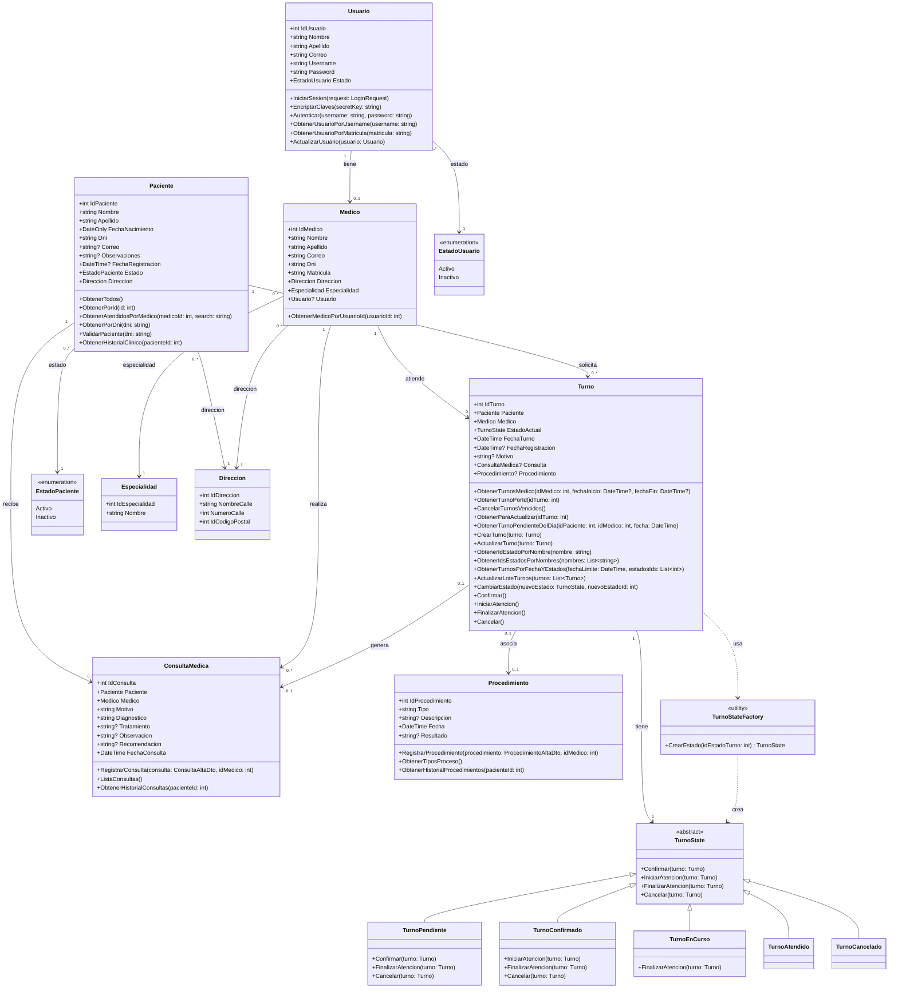

# Diagrama de Clases consolidado por Entidad - Clinicks

Este diagrama agrupa los atributos (campos de base de datos) y simplifica los métodos asociados de cada entidad, mostrando principalmente los de la capa de negocio (Servicios) y los métodos únicos de otras capas (Controlador/Repositorio) que no tienen equivalencia directa en la capa de negocio. Además, incorpora la abstracción y concreción del patrón de diseño **State** para gestionar los estados del turno de forma dinámica.

